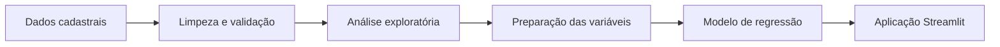

# Previsão de Renda

Aplicação de ciência de dados que estima a renda a partir de informações cadastrais. O projeto percorre todo o ciclo analítico: entendimento do problema, exploração, preparação, modelagem, avaliação e disponibilização em uma interface Streamlit.

## Problema

Informações cadastrais possuem padrões que podem ajudar a estimar faixas de renda. O projeto organiza esses dados, investiga as relações mais relevantes e treina um modelo de regressão para produzir estimativas reproduzíveis.

## Valor para o negócio

Uma solução desse tipo pode apoiar:

- segmentação e análise de perfis;
- estudos de potencial de consumo;
- priorização de análises comerciais;
- validação de hipóteses sobre comportamento cadastral;
- disponibilização de modelos para usuários não técnicos.

> As previsões deste projeto são educacionais e não devem ser utilizadas isoladamente em decisões financeiras ou de crédito.

## Fluxo da solução



## Funcionalidades

- análise exploratória univariada e bivariada;
- relatório automatizado de perfil dos dados;
- tratamento e preparação das variáveis;
- treinamento de árvore de regressão;
- visualizações para interpretação dos resultados;
- simulação interativa em Streamlit.

## Tecnologias

Python, Pandas, NumPy, Matplotlib, Seaborn, scikit-learn, Jupyter e Streamlit.

## Estrutura

```text
Projeto_02.py                               aplicação Streamlit
ebac-projeto02-previsao_eduardo-quero.ipynb análise completa
input/                                      dados de entrada
output/                                     artefatos gerados
pages/                                      páginas adicionais
requirements.txt                            dependências
```

## Executar localmente

Requer Python 3.10 ou superior.

```bash
git clone https://github.com/EduardoQuero/previsao-renda.git
cd previsao-renda
python -m venv .venv
```

Ative o ambiente e execute:

```bash
pip install -r requirements.txt
pip install streamlit pandas numpy matplotlib seaborn
streamlit run Projeto_02.py
```

A aplicação ficará disponível em `http://localhost:8501`.

## Dados e confidencialidade

Este é um projeto educacional com dados próprios para demonstração. Não contém informações de empregadores, clientes, credenciais ou regras internas.

## Autor

[Eduardo Quero](https://www.linkedin.com/in/eduardo-quero/)